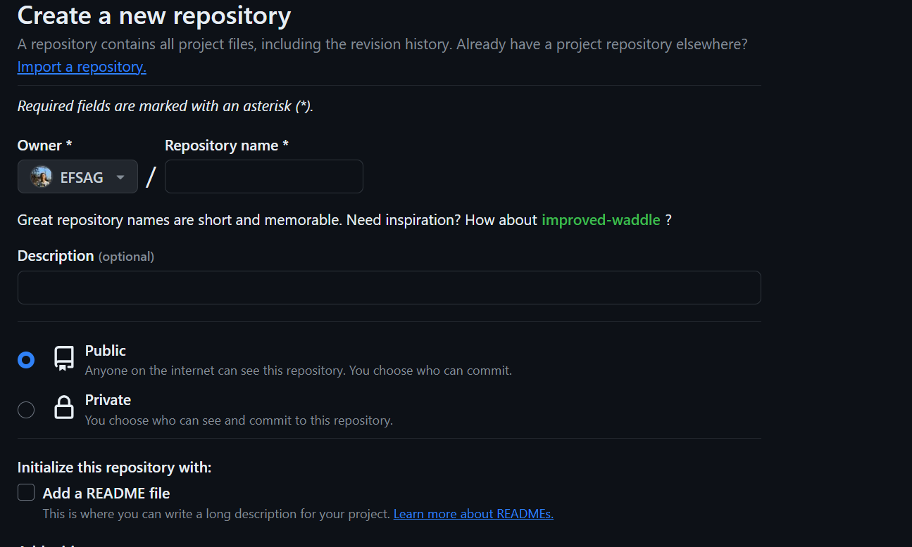

# Git_Aufgabe_Efe_Abel M364

Git Aufgabe

1. Registrieren Sie sich bei einem Gitanbieter (Github, Gitlab, Bitbucket o.ä.) und erstellen Sie ein eigenes Repository.
2. Erstellen Sie für jeden der folgenden Begriffe ein eigenes Markdown-File und verlinken Sie diese vom README.md.
• IaaS, PaaS und SaaS • OnPremise, Public-, Private- und Hybridcloud
3. Definieren Sie die Begriffe mit möglichst eigenen Worten und fügen Sie womöglich auch Grafiken hinzu. Weiterführende Links sind ebenfalls wünschenswert. Vertiefen Sie damit Ihre Markdown-
Kenntnisse.

### 1:

Hier beschrifte ich mein Repository und mache es zu public und wähle den Readme.md file aus.

Danach schreibe ich auf vsc terminal git clone 'link von Repo'

### 2:

<li> <a href="/Git_Aufgabe_Efe_Abbel/IaaS.md">Iaas</a>
<li> <a href="/Git_Aufgabe_Efe_Abbel/PaaS.md">PaaS</a>
<li> <a href="/Git_Aufgabe_Efe_Abbel/SaaS.md">SaaS</a>