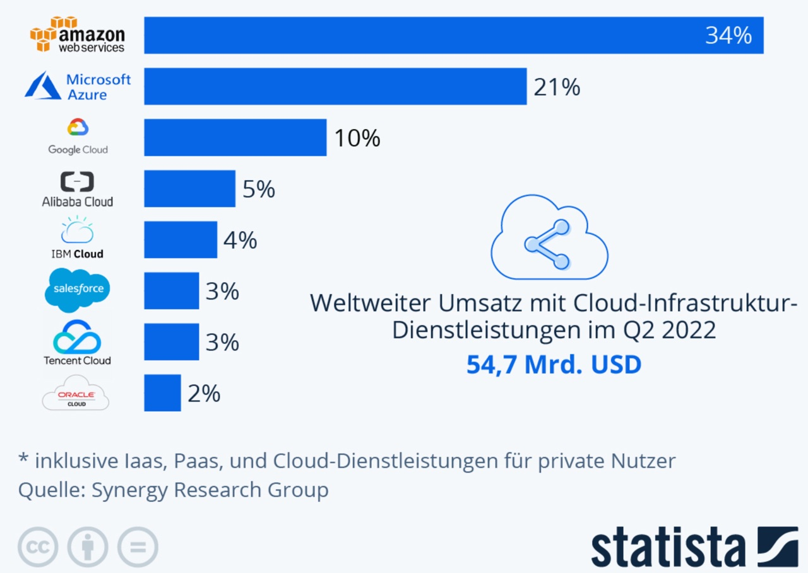

# Private Cloud

Von einer Public Cloud wird gesprochen, wenn die Services von der Allgemeinheit oder einer grossen Gruppe, wie beispielsweise einer ganzen Industriebranche, genutzt werden können und die Services von einem Anbieter zur Verfügung gestellt werden.

Im 2. Quartal 2022 betrug der weltweite Umsatz von Cloud-Infrastruktur-Dienstleistungen 54.7 Mrd. USD. Den zur Zeit stark steigenden Umsatzkuchen teilen sich die Marktführer Amazon, Microsoft, Goolge, Alibaba, IBM Salesforce, Tencent und Oracle wie folgt auf:

<a href="/Git_Aufgabe_Efe_Abbel/README.md">zurück</a>